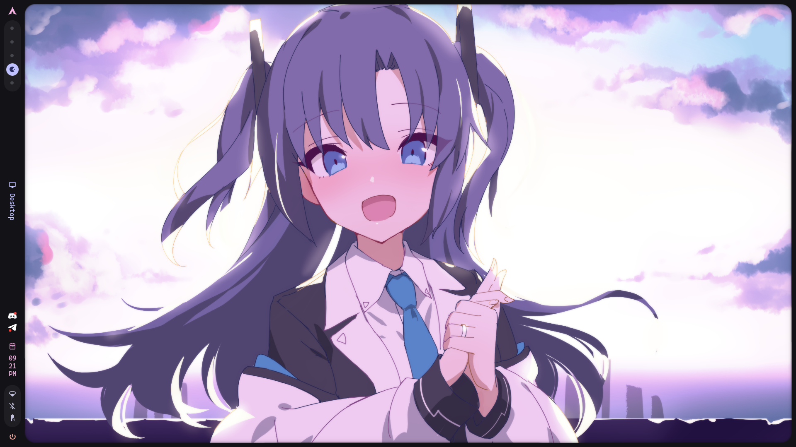
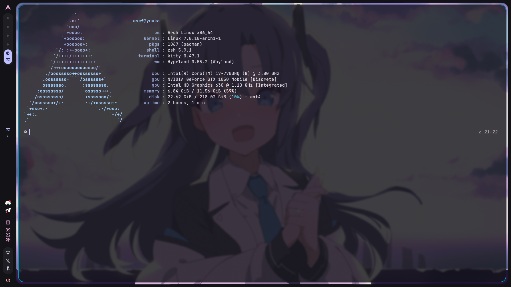

# yuuka dotfiles

> **Arch Linux** · **Hyprland** · **Caelestia** — Acer Nitro AN515-51
>
> Hayase Yuuka themed. Dark. Transparent. No bloat.

---

## Preview




---

## Hardware

| Component | Spec |
|-----------|------|
| **Machine** | Acer Nitro AN515-51 |
| **CPU** | Intel Core i7-7700HQ @ 2.80GHz |
| **GPU (iGPU)** | Intel HD Graphics 630 |
| **GPU (dGPU)** | NVIDIA GeForce GTX 1050 Mobile |
| **Display** | 1920×1080 @ 60Hz (eDP-1) |
| **OS** | Arch Linux |
| **Kernel** | Linux 7.x (Arch) |

---

## Stack

| Role | Tool |
|------|------|
| **Display Manager** | ly |
| **Session** | uwsm |
| **Compositor** | Hyprland |
| **Desktop Shell** | Caelestia (quickshell) |
| **Terminal** | Kitty |
| **Shell** | Zsh + Starship |
| **App Launcher** | Fuzzel + Rofi |
| **Lock Screen** | Hyprlock |
| **Idle Daemon** | Hypridle |
| **System Monitor** | Btop |
| **Fetch** | Fastfetch |
| **Theming** | Matugen (shadotheme) |
| **Screenshot** | Grimblast |
| **Clipboard** | Cliphist |
| **File Manager** | Dolphin |
| **Fonts** | JetBrainsMono Nerd Font, FiraCode Nerd Font |

---

## Device Role

This is not my main workstation, i use this device as a sidekick for when i dont want to be on my desktop or want to take it with me on the go. I mainly use it for browsing or text editing so i didnt need much configuration. It just works.

---

## Installation

> **Requires**: Fresh Arch Linux install with internet. Nothing else.

```bash
git clone https://github.com/esefxdz/dotfiles.git ~/dotfiles
cd ~/dotfiles
chmod +x install.sh
./install.sh
```

The script will:
1. Install `paru` (AUR helper) if not present
2. Install all packages from `packages.txt`
3. Set `zsh` as the default shell
4. Symlink every config to the right location
5. Copy wallpapers to `~/wallpapers/`
6. Enable `NetworkManager` and `ly` services

After reboot, log in and run:
```bash
caelestia scheme set -n shadotheme
caelestia wallpaper -f ~/wallpapers/wallpaper.png
```

---

## Keybinds

> Full list in [`.config/hypr/hyprland.conf`](./.config/hypr/hyprland.conf)

---

## GPU Notes

Laptop uses **NVIDIA Optimus** (Intel iGPU + GTX 1050 dGPU).

- Driver: `nvidia-580xx-dkms` (legacy fork for GTX 10xx, dont try 610 or 570 or anything else, this one works)

- Switching tool: `envycontrol`

```bash
sudo envycontrol -s nvidia      # dGPU only
sudo envycontrol -s integrated  # iGPU only (max battery)
sudo envycontrol -s hybrid      # Optimus mode, what i use
```

---

## Notes

- **Keyboard**: Turkish layout (`tr`) — change `kb_layout` in `hyprland.conf` if you want to change that.
- **Monitor**: `eDP-1` at `1920x1080@60` — change `monitor=` line for your display
